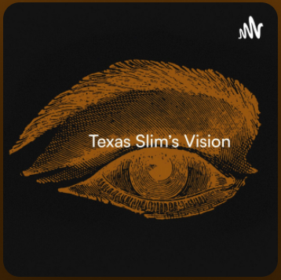
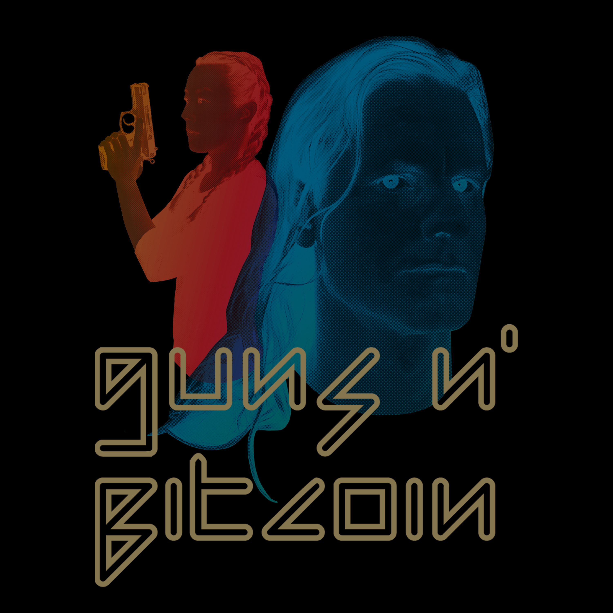
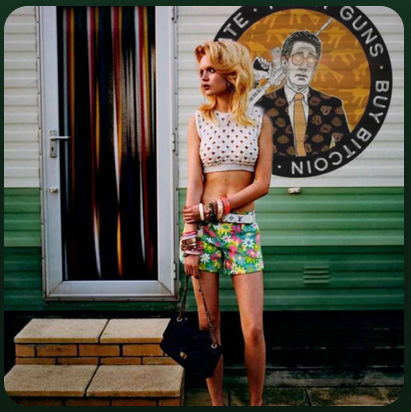
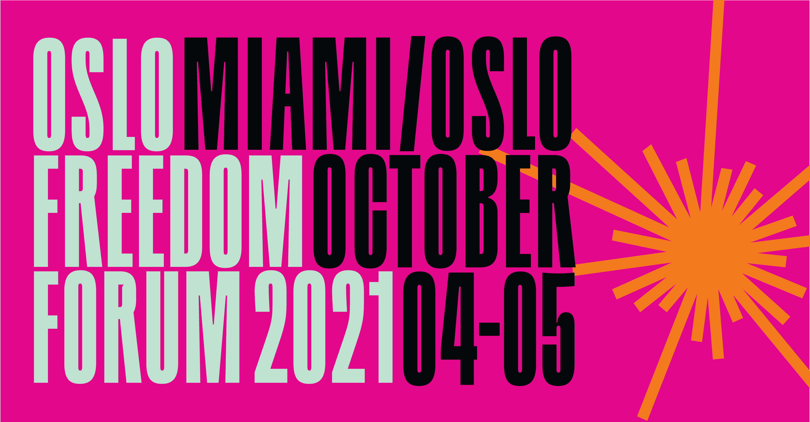
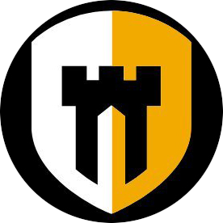
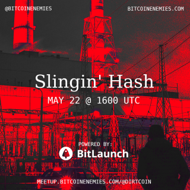
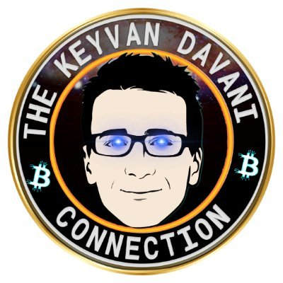
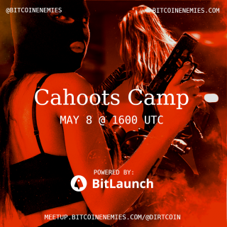

# Find all my interviews here in order of the most recent.

## [Gold Silver Bitcoin #46](https://www.youtube.com/watch?v=NmD6Tjg4fAA)
Bitcoin without bridges to the legacy system with [@GldSlvBtc](https://twitter.com/GldSlvBtc) and [@Econoalchemist](https://twitter.com/econoalchemist)

By the Gold Silver Bitcoin Show January 4, 2022

- Bitcoin as a stand alone financial system
- Issues with the legacy system
- Self-custody
- Dangers of KYC
- Home Mining

  

## [Texas Slim's Vision](https://open.spotify.com/episode/3hyBJ7c5pROwED6FhUy53x?si=2VfqT2_QQfyTwwXjsATOxQ&utm_source=copy-link&nd=1)
Home Mining and Self-Custody with [@modernTman](https://twitter.com/modernTman) and [@Econoalchemist](https://twitter.com/econoalchemist)

By Texas Slim December 29, 2021

- Home mining
- Self custody
- Non-KYC purchasing
- Differences between city & country
- Econo's audio background
- The BeefInitiative and FoodIntelligence

  

## [Guns N' Bitcoin](https://gunsnbitcoin.substack.com/p/32-econoalchemist-twitter-spaces)
Twitter Spaces with [@Ragnarly](https://twitter.com/Ragnarly) & [@econoalchemist](https://twitter.com/econoalchemist)

By Guns N' Bitcoin November 23, 2021

- Bitcoin self custody
- Bitcoin as a permissionless tool
- The April 2022 Bear Arms N' Bitcoin Conference in Miami

  

## [Blue Collar Plebcast Season 1, Episode 19](https://open.spotify.com/episode/3scPhrHu696lpaVOOngkLZ?si=P9xA6q53TPCpFvp2wepo9w&utm_source=copy-link&nd=1) 
Bitcoin Home Mining with [@BITCOIN_RAIL](https://twitter.com/BITCOIN_RAIL), [@RoninMiner](https://twitter.com/RoninMiner), [@lc_hodl2](https://twitter.com/lc_hodl2), & [@econoalchemist](https://twitter.com/econoalchemist)

By Blue Collar Plebcast October 17, 2021

- Mining setups
- Life lessons
- We also talk work, family, inflation and more

  

## [Compass Home Mining Panel](https://youtu.be/vBzaXLvgSwo)
Compass Mining Panel Discussion with [@BitcoinCoderBob](https://twitter.com/BitcoinCoderBob), [@missaghi](https://twitter.com/missaghi), [@BITCOIN_RAIL](https://twitter.com/BITCOIN_RAIL), [@CaliInKansas](https://twitter.com/CaliInKansas), & [@econoalchemist](https://twitter.com/econoalchemist)

By Compass Mining:  [@zackvoell](https://twitter.com/zackvoell) & [@wsfoxley](https://twitter.com/wsfoxley) October 6, 2021

- Solutions to home mining obstacles

  

## [Oslo Freedom Forum Presentation](https://youtu.be/41w_5K8iYpA)
Bitcoin Home Mining Overview with [@econoalchemist](https://twitter.com/econoalchemist)

By [@HFR](https://twitter.com/HRF) during the Bitcoin Academy in Miami, FL USA October 5, 2021

- False Narratives
- Why is mining at home sensible
- What is an ASIC
- How to buy an ASIC
- Infrastructure requirements
- Connecting to a mining pool

  

## [Citadel Dispatch e0.3.1](https://bitcointv.com/w/fnCudFVejsMjZQUGRq72eU)
Getting Started with Bitcoin Mining with [@Diverter_NoKYC](https://twitter.com/Diverter_NoKYC) [@RoninMiner](https://twitter.com/RoninMiner) & [@econoalchemist](https://twitter.com/econoalchemist)

By [@ODELL](https://twitter.com/ODELL) July 20, 2021

- Sourcing an ASIC
- Infrastructure; Electrical, Noise, & Ventilation
- Hosted Mining
- non-KYC Dollar Cost Averaging through the utility bill

  

## [DirtCoin Diaries #7: Slingin' Hash](https://meetup.bitcoinenemies.com/@dirtcoin/slingin-hash)
Bitcoin Home Mining with [@Diverter_NoKYC](https://twitter.com/Diverter_NoKYC) & [@econoalchemist](https://twitter.com/econoalchemist)

By Christopher Carrion May 21, 2021

- How to mine bitcoin at home
- What to avoid
- Mitigating heat & noise

  

## [DirtCoin Diaries #7: After Hours](https://meetup.bitcoinenemies.com/@dirtcoin/slingin-hash-afterhours)
Bitcoin Home Mining discussion continued with [@Diverter_NoKYC](https://twitter.com/Diverter_NoKYC) & [@econoalchemist](https://twitter.com/econoalchemist)

By Christopher Carrion May 21, 2021

- Diverter_NoKYC & Econoalchemist tag team
- Audience participation
- Open discussion

  

## [TotalBitcoin #176: Bisq Tutorial for Bitcoin Beginners](https://youtu.be/6FMsIUkFdkg)
Introduction to Bisq with [@econoalchemist](https://twitter.com/econoalchemist)

By [@keyvandavani](https://twitter.com/keyvandavani) May 22, 2021

- Buying mom-KYC bitcoin at an ATM
- Basic set up for Bisq
- How to secure your seed phrase
- How to place a trade

  

## [DirtCoin Diaries #6: Cahoots Camp](https://meetup.bitcoinenemies.com/@dirtcoin/cahoots-camp)
Collaborative transactions with [@econoalchemist](https://twitter.com/econoalchemist)

By Christopher Carrion May 7, 2021

- How to spend bitcoin more privately.
- What are Cahoots Stowaway, Stonewall, & StonewallX2.
- Why is privacy important?

  

 
## [DirtCoin Diaries #6: After Hours](https://meetup.bitcoinenemies.com/@dirtcoin/cahoots-camp-afterhours)
The discussion on collaborative transactions continues with [@econoalchemist](https://twitter.com/econoalchemist)

By Christopher Carrion May 7, 2021

- Audience participation.
- Open discussion.

  

## [TotalBitcoin #171: Sparrow Wallet Tutorial for Bitcoin Beginners](https://youtu.be/e_vbPsNdpd0)
Introduction to [Sparrow Wallet](https://www.sparrowwallet.com/) with [@econoalchemist](https://twitter.com/econoalchemist)

By [@keyvandavani](https://twitter.com/keyvandavani) April 24, 2021

- Basic set up for Sparrow Wallet
- How to secure your seed phrase
- How to receive & send bitcoin

  

## [CitizenHush: Bitcoin, Liberty, & Financial Tyranny](https://youtu.be/tTZCOdMkGKU)
Radical Responsibility with [@econoalchemist](https://twitter.com/econoalchemist)

By [@citizenhush](https://twitter.com/citizenhush) April 20, 2021

- Bitcoin basics
- Parallels between gun ownership & Bitcoin self-custody
- KYC vs. non-KYC

  

